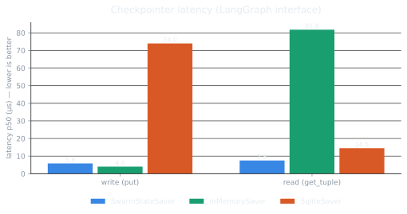
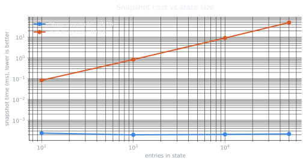

# Benchmarks

Every number here is **reproducible** - run
[`benchmarks/run.py`](https://github.com/swarmstate/swarmstate/blob/main/benchmarks/run.py)
yourself:

```bash
pip install "swarmstate[langgraph]" langgraph-checkpoint-sqlite matplotlib
# or: uv add "swarmstate[langgraph]" langgraph-checkpoint-sqlite matplotlib
python benchmarks/run.py --iters 5000 --seed 7
```

!!! warning "Read the setup before comparing"
    - **Release build** (published wheels / `maturin develop --release`). Debug builds
      are several times slower.
    - `SwarmStateSaver` and `InMemorySaver` are **in-memory**; `SqliteSaver` is
      **file-backed** (persists to disk). The `put` comparison reflects the cost of
      SQLite-backed persistence as commonly configured; a persistent swarmstate backend
      (redis/disk) is on the [roadmap](roadmap.md).
    - Warm cache, single process. Hardware/versions below.

## Checkpoint latency (LangGraph interface)

{ width="720" }

Per-operation latency through LangGraph's `BaseCheckpointSaver` interface:

| Checkpointer | `put` p50 | `put` p99 | `put` throughput | `get_tuple` p50 |
| --- | --- | --- | --- | --- |
| **SwarmStateSaver** | **5.8 µs** | 13.9 µs | **~158k ops/s** | **7.5 µs** |
| InMemorySaver | 4.0 µs | 8.5 µs | ~203k ops/s | 81.8 µs |
| SqliteSaver (file) | 74.0 µs | 323 µs | ~9.5k ops/s | 14.5 µs |

- **`put` is ~12.8× faster than `SqliteSaver`** - no per-step disk commit.
- **`get_tuple` (latest) is ~11× faster than `InMemorySaver`**: swarmstate keeps an O(1)
  "latest checkpoint" pointer, where the reference saver scans keys.

## Snapshot cost vs state size

{ width="720" }

`Store.snapshot()` is **O(1)** (persistent data structure + a running byte counter), so
it stays flat as state grows, while `copy.deepcopy` is O(n):

| entries | `Store.snapshot()` | `dict` deepcopy | speedup |
| --- | --- | --- | --- |
| 100 | 0.0003 ms | 0.086 ms | ~300× |
| 1,000 | 0.0002 ms | 0.86 ms | ~4,000× |
| 10,000 | 0.0002 ms | 9.3 ms | ~44,000× |
| 50,000 | 0.0002 ms | 52 ms | **~236,000×** |

This is what makes [time-travel over the whole checkpoint DB](tutorials/langgraph.md)
practically free.

## Concurrency scaling (free-threaded)

The store shards its write locks and releases the GIL on the hot paths, so on a
**free-threaded (no-GIL) CPython build** it scales across cores. Same set+get workload,
8 threads writing distinct namespaces:

| Build | 1 thread | 8 threads | scaling |
| --- | --- | --- | --- |
| CPython 3.14 (GIL) | ~990k ops/s | ~196k ops/s | **0.2x** |
| Free-threaded 3.13t | ~1.0M ops/s | **~1.9M ops/s** | **~1.9x** |

!!! warning "This only shows up without the GIL"
    On standard (GIL) CPython, adding threads makes this workload **slower**: the GIL
    serializes the Python-side work and thread overhead dominates. The multi-core win
    needs a free-threaded interpreter (`cp313t`), for which swarmstate ships
    version-specific wheels. See [Architecture](architecture.md#free-threaded-no-gil).

Batching compounds it: on the free-threaded build, `set_many` (batches of 50) reaches
**~7.3M set/s** versus **~1.9M set/s** for individual `set`s at 8 threads (~4x).

## Environment

| | |
| --- | --- |
| Machine | Apple Silicon (macOS, arm64) |
| Python | 3.14 |
| swarmstate | 0.4.0 (release wheel) |
| langgraph | 1.2.x · langgraph-checkpoint 4.x |
| iters / warmup | 4,000 / 400 · seed 7 |

Numbers vary by hardware - regenerate on yours with the command above.
