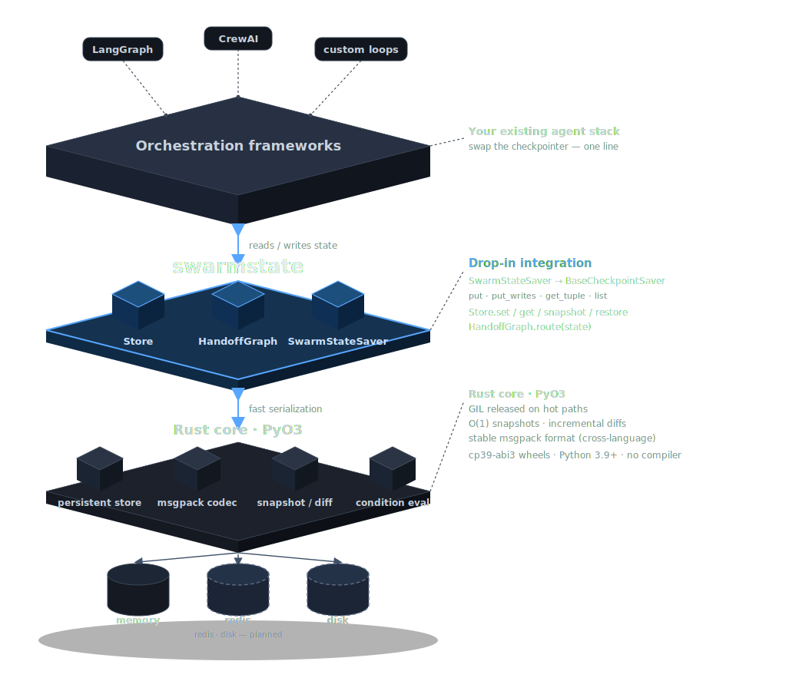

---
hide:
  - navigation
  - toc
---

<div class="ss-hero" markdown="1">

# swarmstate

<p class="ss-tag">Drop-in state backend for LangGraph, CrewAI &amp; custom agent loops —
Rust core, framework-agnostic, built for production.</p>

<code>pip install swarmstate</code>

<div class="ss-cta" markdown="1">
[Get started](guide/store.md){ .md-button .md-button--primary }
[GitHub](https://github.com/swarmstate/swarmstate){ .md-button }
</div>

</div>



<p class="ss-stack-cap">Where swarmstate sits: underneath your orchestration framework, as the fast state &amp; checkpointing engine.</p>

<div class="ss-features" markdown="1">

<div class="ss-card" markdown="1">
### No state lock-in
A framework-agnostic store with a stable, language-neutral (msgpack) format.
Migrate between frameworks without losing accumulated state.
</div>

<div class="ss-card" markdown="1">
### Fast checkpointing
A Rust core with fast serialization, O(1) immutable snapshots and incremental
diffs. The GIL is released on the hot paths.
</div>

<div class="ss-card" markdown="1">
### Deterministic routing
Rule-based "which agent is next" decisions resolved natively in Rust — no LLM
tokens spent on transitions you can express as rules.
</div>

</div>

---

`swarmstate` is **not** an orchestration framework and does not compete with LangGraph,
CrewAI or AutoGen. It is the fast engine that sits **underneath** them — the same way a
fast columnar engine sits underneath data workloads.

```python
import swarmstate as ss

store = ss.Store()                               # in-memory, msgpack codec
store.set("workflow", "onboarding", {"step": 3})
snap = store.snapshot()                          # cheap, immutable snapshot

store.set("workflow", "onboarding", {"step": 4})
store.restore(snap)                              # rollback
store.get("workflow", "onboarding")              # -> {"step": 3}
```

See the [Guide](guide/store.md) to get started, or the [API reference](api.md) for the
full surface.
